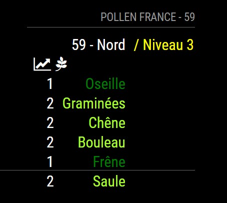

# MMM-Pollen
MagicMirror module to get the pollen.fr forecast for your region code
inspired by WWW-POLLEN https://github.com/vincep5/MMM-Pollen

## Preview


## Installation
1. Navigate into your MagicMirror's `modules` folder and execute `git clone https://github.com/lekesako/MMM-Pollen-FR`.  A new folder `MMM-Pollen-FR` will appear, navigate into it.
2. Execute `npm install` to install the node dependencies.

## Config
The entry in `config.js` can include the following options:

|Option|Description|
|---|---|
|`updateInterval`|**Required** update interval to refresh data for api pollen FR<br><br>**Type:** `string`<br>**Default value:** `null`|
|`region_code`|This is the region code (example : 75 for Paris) of the location you want to get the pollen risks for.<br><br>**Type:** `number`<br>**Default value:** `null`|
|`minLevel`|This is the minimal risk you want to display.<br><br>**Type:** `number`<br>**Default value:** `1`|

Here is an example of an entry in `config.js`
```
modules: [
  {
    module: "MMM-Pollen-FR",
    position: "top_left",
    header: "Météo Pollen France",
    config: {
        updateInterval: 3 * 60 * 60 * 1000, // every 3 hours
        region_code: "59",
        minLevel: 0
    }
  },
]
```

## Thanks To...
- [Michael Teeuw](https://github.com/MichMich) for the [MagicMirror2](https://github.com/MichMich/MagicMirror/tree/develop) framework that made this module possible.
- [vincep5](https://github.com/vincep5) whose [MMM-Pollen](https://github.com/vincep5/MMM-Pollen) module I use and whose code I learnt a great deal from.